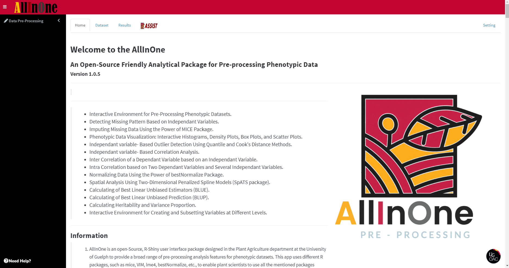

<!-- README.md is generated from README.Rmd. Please edit that file -->

# **AllInOne** 


<br/>
<br/>

# [](https://github.com/MohsenYN)

The **AllInOne** is an open-Source, R-Shiny user interface package designed in the [Plant Agriculture](https://www.plant.uoguelph.ca/) department at the [University of Guelph](https://www.uoguelph.ca) to provide a broad range of pre-processing analysis features for phenotypic datasets. This app uses different R packages, such as mice, VIM, lme4, bestNormalize, etc., to enable plant scientists to use all the mentioned packages simultaneously in an interactive environment. Furthermore, it allows plant scientists to edit, organize, subset, and sort datasets in a live mode.

**If you enjoy working with AllInOne, give us a star on GitHub and Cite the package, please :)**

<!-- BEGIN LATEST DOWNLOAD BUTTON -->
[][https://github.com/MohsenYN/AllInOne/CiteAllInOne.ris)]
<!-- END LATEST DOWNLOAD BUTTON -->


## **Demo**

Just click [HERE](https://allinone.shinyapps.io/allinone/).


[](https://allinone.shinyapps.io/allinone/)

<br/>

## **Installation**

Required: [R](https://cran.r-project.org/) version 4.0.0 or later
<br/>
Required: [Rstudio](https://posit.co/download/rstudio-desktop/)
<br/>
Required: [golem](https://github.com/ThinkR-open/golem) R package version 0.3.4 or later:
<br/>
Required: [shinydashboard](https://rstudio.github.io/shinydashboard/) R package version 0.7.2 or later
<br/>
Required: [shinydisconnect](https://github.com/daattali/shinydisconnect) R package version 0.1.0 or later
<br/>
Required: [shinyjs](https://deanattali.com/shinyjs/) R package version 2.1.0 or later
<br/>
Required: [SpATS](https://cran.r-project.org/web/packages/SpATS/index.html) R package version 1.0-16 or later
<br/>
Required: [remotes](https://cran.r-project.org/web/packages/remotes/index.html) R package
<br/>

``` r
install.packages(c("remotes","golem","shinydashboard","shinydisconnect","shinyjs"))
```


### **Install using source**

You can install the AllInOne using its source on your system like so:

``` r
remotes::install_local('path/to/AllInOne/', force = TRUE)
```

### **Install from GitHub**

You can install the AllInOne from GitHub like so:

``` r
remotes::install_github('MohsenYN/AllInOne')
```

## **How to run**

### **Run without installing**

You can run the application by just running `app.R` without installing the package.

### **Run after installation**

``` r
AllInOne::run_app()
```

## **What do you think about AllInOne?**

Let us know :)
<br/>

[Mohsen Yoosefzadeh Najafabadi](mailto:myoosefz@uoguelph.ca?subject=[GitHub]%20question/feedback%20about%20AllInOne)

Soybean Breeding & Computational Biology
<br/>
Department of Plant Agriculture
<br/>
University of Guelph
<br/>

 
 
### ENJOY!
<br/>
<br/>


#### **We are proud of our partners:**
<br/>

[](https://agriculture.canada.ca/en)

<br/>

[](https://www.uoguelph.ca/)

<br/>

[](https://genomecanada.ca/)

<br/>

[](https://www.genomequebec.com/)

<br/>

[](https://prograin.ca/)

<br/>

[](https://gfo.ca/)

<br/>

[](http://www.fieldcropresearch.ca/)

<br/>

[](https://cerom.qc.ca/)

<br/>

[](https://www.barleycanada.com/)

<br/>

[](https://sollio.ag/en)

<br/>

[](https://www.ulaval.ca/en)

<br/>

[](https://www.usask.ca/)


